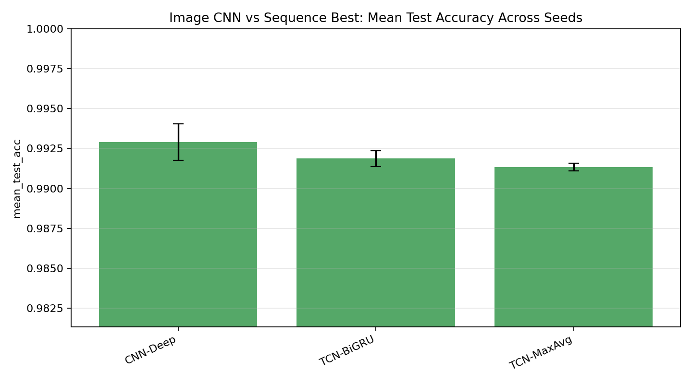

# AGENTS.md

このリポジトリで実験を追加・実行・報告するときの標準手順を定める。

## 基本方針

- 実験は「結果を出す」だけでなく、仮説を明示して検証する。
- 既存結果と比較できるように、データ分割、epoch 数、seed、batch size、device を必ず記録する。
- 単発 seed の結果だけで強い結論を出さない。重要な結論は multi-seed で確認する。
- 精度だけでなく、収束曲線、所要時間、パラメータ数も併せて見る。
- レポートは表だけで終わらせず、図と解釈を含める。

## 実験の進め方

新しい研究ラウンドは、次の順で進める。

1. 既存結果から問いを立てる
2. 仮説を書く
3. 比較対象モデルを決める
4. subset screen を回す
5. 結果から finalist を選ぶ
6. full-data 追試を回す
7. 重要な結論は multi-seed で確認する
8. 図を生成する
9. レポートを書く
10. `README.md` と `RESULT.md` に要点を追記する

## 実験設定の標準

subset screen:

- train subset: `12000`
- val subset: `4000`
- test: `10000`
- epochs: `6`
- batch size: `256`
- seed: 原則 `42`

full-data 追試:

- train: `40000`
- val: `20000`
- test: `10000`
- epochs: `10`
- batch size: `256`
- seed: 原則 `42`

multi-seed 確認:

- seed: `42`, `123`, `777`
- 対象は finalist に絞る
- 平均と標準偏差を出す

## artifact の保存

実験結果は原則として以下に保存する。

- 単発実験: `artifacts/experiments/<suite>_results.json`
- 単発 summary: `artifacts/experiments/<suite>_summary.csv`
- multi-seed 各 seed: `artifacts/multiseed/<suite>/seed<seed>/<suite>_summary.csv`
- multi-seed aggregate: `artifacts/multiseed/<suite>_aggregate.csv`
- 図: `artifacts/plots/*.png`
- 長いログ: `artifacts/logs/*.log`

一時的な smoke test 出力は PR に含めない。

## レポートの標準フォーマット

実験レポートは Markdown で作成する。ファイル名は内容が分かる名前にする。

例:

- `EXPERIMENT_REPORT.md`
- `IMAGE_VS_SEQUENCE_REPORT.md`

必須構成:

1. `目的`
2. `仮説`
3. `比較したモデル`
4. `実験 1: subset screen`
5. `実験 2: full-data finalists`
6. `実験 3: multi-seed 確認`
7. `仮説の判定`
8. `最終結論`
9. `参照ファイル`

## モデル説明の書き方

モデル表には最低限以下を書く。

| Model | 分類 | 特徴 |
| --- | --- | --- |
| `ModelName` | model group | 何を入力として、どの inductive bias を持つか |

分類の例:

- recurrent sequence
- transformer sequence
- convolutional sequence
- hybrid sequence
- image baseline
- 2D CNN

## 結果表の書き方

単発実験の表には以下を含める。

| Model | Params | Best Val Acc | Test Acc | Elapsed |
| --- | ---: | ---: | ---: | ---: |

multi-seed の表には以下を含める。

| Model | Runs | Mean Val Acc | Std Val Acc | Mean Test Acc | Std Test Acc | Params |
| --- | ---: | ---: | ---: | ---: | ---: | ---: |

accuracy は原則として小数 6 桁で保存し、本文中では必要に応じて 4-6 桁で示す。

## 図の標準

レポートには可能な限り以下の図を入れる。

- subset screen の validation accuracy 曲線
- full-data finalists の validation accuracy 曲線
- top models の `train loss / val loss / val acc`
- multi-seed の `mean ± std` validation curve
- multi-seed の mean test accuracy bar plot
- accuracy vs time trade-off
- accuracy vs parameter count

図は `artifacts/plots/` に保存し、Markdown から相対パスで参照する。

例:

```md

```

## 収束の扱い

「収束した」と主張する場合は、validation accuracy だけでなく可能な限り以下も確認する。

- train loss が下がっているか
- val loss が頭打ちになっているか
- val acc が plateau しているか
- 後半 epoch で過学習傾向があるか
- seed 間で同じ傾向か

元 artifact に per-epoch wall-clock がない場合は、`elapsed_seconds / epochs` を平均 epoch 時間として使い、その制約を明記する。

新規 runner を変更できる場合は、`epoch_logs` に `epoch_seconds` を保存する。

## 仮説判定の書き方

仮説は曖昧に終わらせず、必ず以下のいずれかで判定する。

- 採択
- 一部採択
- 棄却
- 保留

判定表を置く。

| 仮説 | 比較 | 指標 | 結果 | 判定 |
| --- | --- | --- | --- | --- |

判定の基準:

- 単発 seed だけで採択する場合は、暫定採択と書く
- 重要な主張は multi-seed 平均で確認してから採択する
- 1 seed で良くても multi-seed で再現しない場合は棄却または保留にする
- 差が小さい場合は、実用上の trade-off も併記する

## 解釈の書き方

結果の解釈では、以下を分けて書く。

- 観測された事実
- そこからの推論
- まだ言えないこと

例:

- 事実: `CNN-Deep` は 3 seed 平均で `TCN-BiGRU` を上回った
- 推論: MNIST では 2D spatial inductive bias が sequence 化より自然
- まだ言えないこと: 他の画像データセットでも同じとは限らない

## README / RESULT の更新

レポートを追加したら、以下も更新する。

- `README.md`: 実行できる suite と現在の主な結論
- `RESULT.md`: 実験結果の要約と仮説判定

詳細な表と図は専用レポートに置き、`README.md` は短く保つ。

## PR の出し方

PR には以下を書く。

- 何を追加したか
- どの実験を回したか
- 主な結果
- 採択/棄却した仮説
- 主要ファイル

PR 本文は日本語でよい。

## 今後の注意

- MNIST を時系列として扱う設定は研究上の比較としては有効だが、画像分類としては不自然である。
- 「時系列モデルが弱い」ではなく、「このデータでは 2D 空間構造を使うモデルが自然」と書く。
- `TCN` の強さは temporal modeling ではなく local convolution の帰納バイアスに由来する可能性が高い、という表現を優先する。
- 結論を強める場合は、モデル数を増やすより seed 数を増やす方が有効なことが多い。
