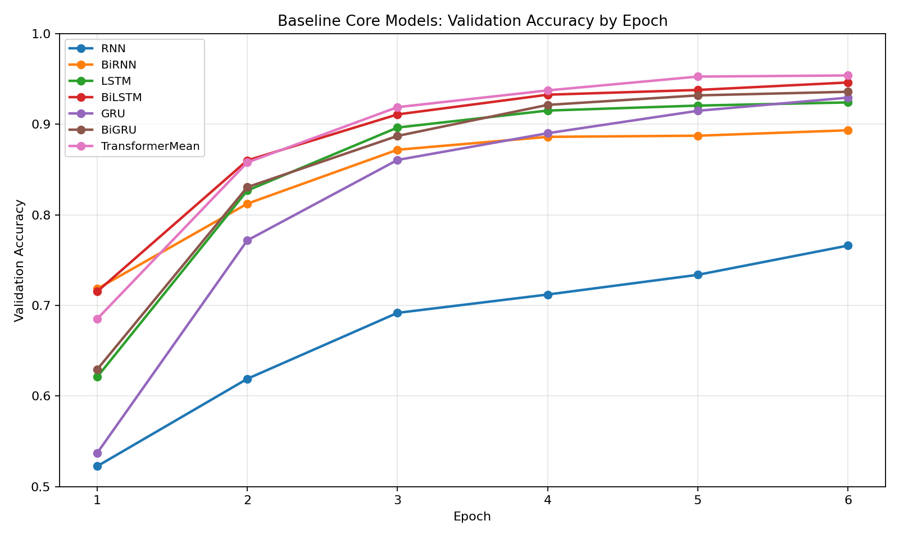
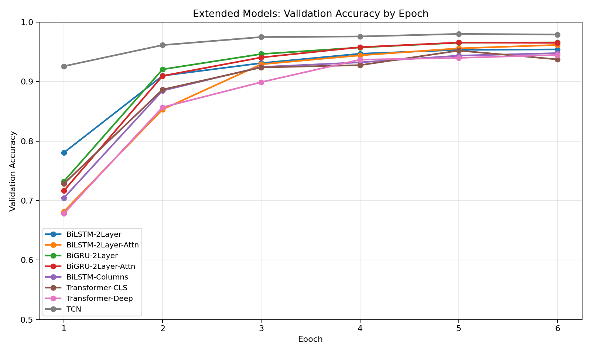
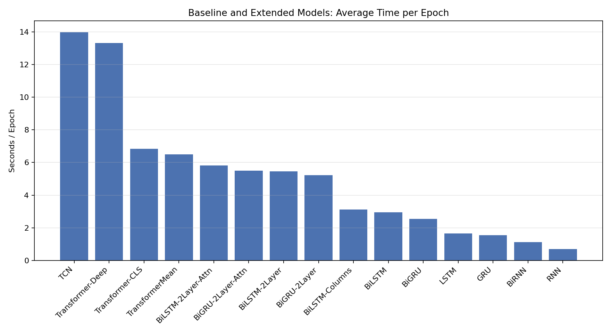
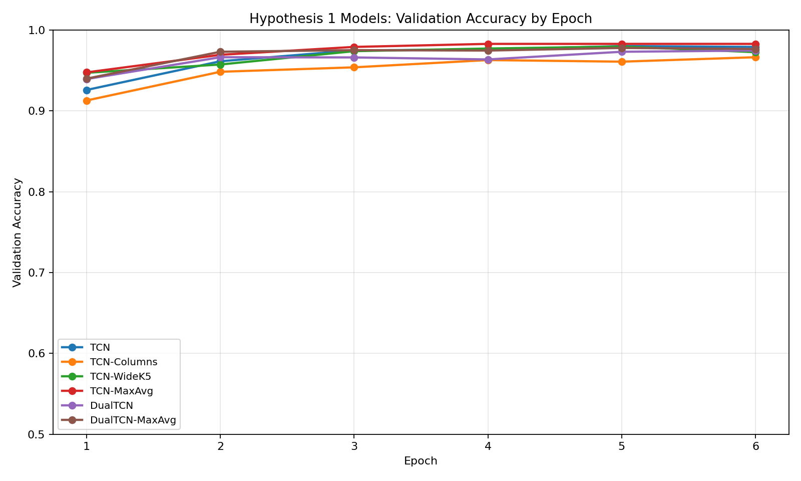
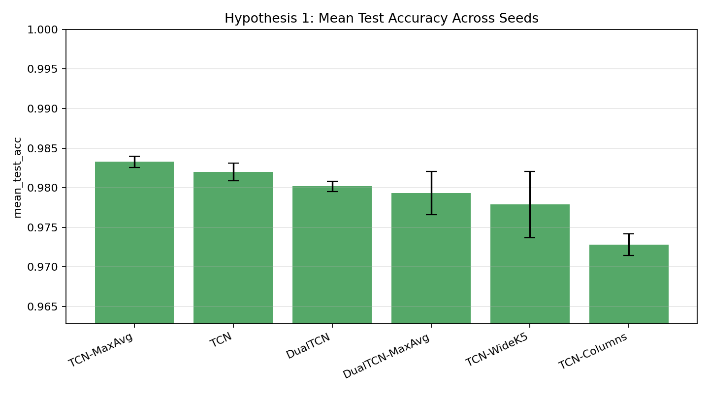
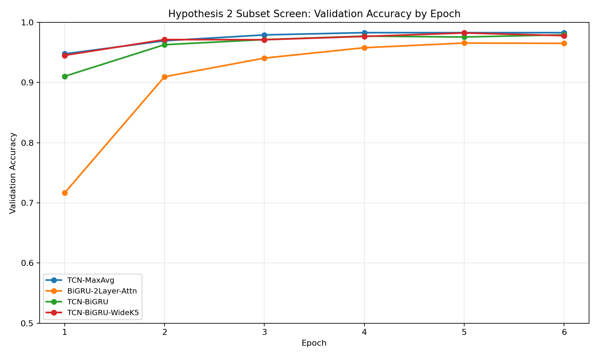
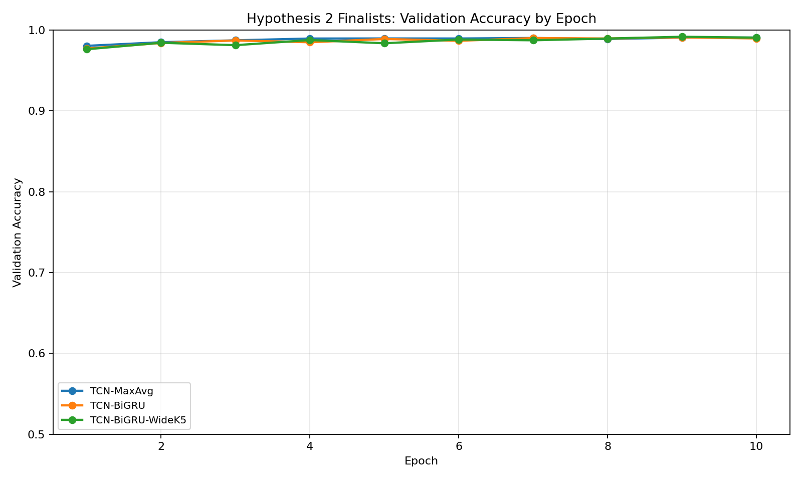
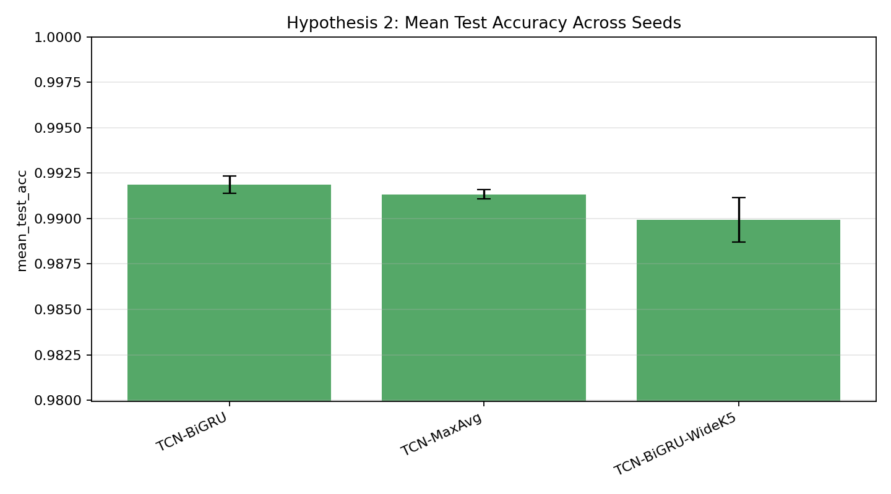

# MNIST Sequence Experiments Report

## 目的

このリポジトリでは、MNIST を通常の 2D 画像としてではなく、`28 x 28` 画像を `28` ステップの系列として見なして比較した。

目的は次の 2 つだった。

1. 画像を無理やり時系列として扱ったとき、どのモデルが強いかを調べる
2. その結果から仮説を立て、追加実験で採択/棄却を判断する

## 前提

- データセット: MNIST
- 入力解釈: `28` 行を `28` ステップの系列と見なす
- 最適化: `Adam`
- 損失関数: `CrossEntropyLoss`
- 実行環境: CPU
- 学習ランナー: `scripts/run_experiments.py`

注意:

- 保存済み artifact には epoch ごとの損失・精度はあるが、元の実験では epoch ごとの wall-clock 時間は保存していない
- そのため、このレポートの「epoch の所要時間」は `total elapsed / epochs` で計算した平均 epoch 時間を記載する

## モデル分類

今回試したモデルは、役割で分けると次の 6 群に分類できる。

| 分類 | モデル | 特徴 |
| --- | --- | --- |
| 素の再帰系 | `RNN`, `BiRNN`, `LSTM`, `BiLSTM`, `GRU`, `BiGRU` | 各時刻を順に読む最も素朴な時系列モデル |
| 深い再帰系 | `BiLSTM-2Layer`, `BiGRU-2Layer` | 1 層目の出力系列 `h1..hT` を次の recurrent 層の入力に使う |
| 再帰 + attention | `BiLSTM-2Layer-Attn`, `BiGRU-2Layer-Attn` | 最終 hidden だけでなく全時刻から重要部分を集約する |
| Transformer 系 | `TransformerMean`, `Transformer-CLS`, `Transformer-Deep` | recurrence なしで全系列を attention で読む |
| 畳み込み時系列系 | `TCN`, `TCN-WideK5`, `TCN-MaxAvg`, `TCN-Columns`, `DualTCN`, `DualTCN-MaxAvg` | 1D temporal convolution で局所パターンを抽出する |
| 畳み込み + 再帰ハイブリッド | `TCN-BiGRU`, `TCN-BiGRU-WideK5` | TCN で局所特徴を作り、その上を BiGRU で読む |

## 各モデルの特徴

### 素の再帰系

- `RNN`: 最も単純な再帰モデル。表現力は低いが軽い
- `BiRNN`: 前向き/後ろ向きの両方向を使う
- `LSTM`: cell state を持ち、長めの依存を扱いやすい
- `BiLSTM`: 双方向 LSTM
- `GRU`: LSTM より軽量な gated recurrent model
- `BiGRU`: 双方向 GRU

### 深い再帰系

- `BiLSTM-2Layer`: 1 層目の出力系列 `h1, h2, ..., hT` を 2 層目に入力する
- `BiGRU-2Layer`: 同上の GRU 版

イメージ:

```text
x1 x2 x3 ... xT
 |  |  |      |
[layer 1 recurrent]
 |  |  |      |
h1 h2 h3 ... hT
 |  |  |      |
[layer 2 recurrent]
 |  |  |      |
z1 z2 z3 ... zT
```

### 再帰 + attention

- `BiLSTM-2Layer-Attn`: 2 層 BiLSTM の出力系列に attention pooling を適用
- `BiGRU-2Layer-Attn`: 2 層 BiGRU の出力系列に attention pooling を適用

### Transformer 系

- `TransformerMean`: encoder 出力を mean pooling で集約
- `Transformer-CLS`: 先頭に `CLS` token を入れてそこを分類に使う
- `Transformer-Deep`: encoder 層数を増やした深い版

### 畳み込み時系列系

- `TCN`: dilation 付き residual 1D convolution block を重ねる
- `TCN-WideK5`: kernel size を `5` に拡大
- `TCN-MaxAvg`: 最後の pooling を average ではなく `max + avg` に変更
- `TCN-Columns`: 行方向ではなく列方向を系列として読む
- `DualTCN`: 行方向と列方向の両方を別 TCN で処理して結合
- `DualTCN-MaxAvg`: `DualTCN` の pooling を `max + avg` に変更

### 畳み込み + 再帰ハイブリッド

- `TCN-BiGRU`: TCN で局所特徴を作ってから BiGRU で readout
- `TCN-BiGRU-WideK5`: TCN 部の kernel size を `5` にした版

## ベースライン実験

### 実験設定

仮説を立てる前のベースラインは、次の 2 段階で構成した。

1. 既存 7 モデルの再ベースライン
2. 強化版 8 モデルの追加比較

共通設定:

- train subset: `12000`
- val subset: `4000`
- test: `10000`
- epochs: `6`
- batch size: `256`
- seed: `42`

### ベースライン一覧

列の意味:

- `Avg/Epoch`: 平均 epoch 時間
- `Val Acc Curve`: validation accuracy の収束系列
- 収束曲線の図は直後の plot を参照

| Model | Group | Params | Avg/Epoch | Best Val Acc | Test Acc | Val Acc Curve |
| --- | --- | ---: | ---: | ---: | ---: | --- |
| RNN | baseline_rnn | 21,514 | 0.71s | 0.7660 | 0.7742 | 0.5225 -> 0.6190 -> 0.6917 -> 0.7120 -> 0.7338 -> 0.7660 |
| BiRNN | baseline_birnn | 43,018 | 1.13s | 0.8932 | 0.9015 | 0.7183 -> 0.8123 -> 0.8718 -> 0.8860 -> 0.8872 -> 0.8932 |
| LSTM | baseline_lstm | 82,186 | 1.66s | 0.9240 | 0.9252 | 0.6210 -> 0.8267 -> 0.8962 -> 0.9150 -> 0.9205 -> 0.9240 |
| BiLSTM | baseline_bilstm | 164,362 | 2.94s | 0.9460 | 0.9484 | 0.7153 -> 0.8600 -> 0.9107 -> 0.9325 -> 0.9377 -> 0.9460 |
| GRU | baseline_gru | 61,962 | 1.55s | 0.9293 | 0.9329 | 0.5370 -> 0.7718 -> 0.8605 -> 0.8900 -> 0.9147 -> 0.9293 |
| BiGRU | baseline_bigru | 123,914 | 2.54s | 0.9357 | 0.9438 | 0.6292 -> 0.8305 -> 0.8870 -> 0.9213 -> 0.9317 -> 0.9357 |
| TransformerMean | baseline_transformer | 273,802 | 6.50s | 0.9537 | 0.9609 | 0.6850 -> 0.8578 -> 0.9187 -> 0.9373 -> 0.9525 -> 0.9537 |
| BiLSTM-2Layer | recurrent | 559,626 | 5.46s | 0.9540 | 0.9608 | 0.7805 -> 0.9097 -> 0.9310 -> 0.9467 -> 0.9533 -> 0.9540 |
| BiLSTM-2Layer-Attn | recurrent | 559,883 | 5.82s | 0.9615 | 0.9678 | 0.6815 -> 0.8532 -> 0.9290 -> 0.9440 -> 0.9557 -> 0.9615 |
| BiGRU-2Layer | recurrent | 420,362 | 5.21s | 0.9657 | 0.9696 | 0.7322 -> 0.9205 -> 0.9463 -> 0.9573 -> 0.9653 -> 0.9657 |
| BiGRU-2Layer-Attn | recurrent | 420,619 | 5.49s | 0.9655 | 0.9702 | 0.7165 -> 0.9095 -> 0.9405 -> 0.9577 -> 0.9655 -> 0.9650 |
| BiLSTM-Columns | recurrent | 164,362 | 3.12s | 0.9477 | 0.9538 | 0.7045 -> 0.8848 -> 0.9245 -> 0.9323 -> 0.9435 -> 0.9477 |
| Transformer-CLS | transformer | 274,058 | 6.85s | 0.9520 | 0.9590 | 0.7282 -> 0.8865 -> 0.9237 -> 0.9275 -> 0.9520 -> 0.9373 |
| Transformer-Deep | transformer | 538,762 | 13.31s | 0.9447 | 0.9518 | 0.6783 -> 0.8568 -> 0.8990 -> 0.9367 -> 0.9397 -> 0.9447 |
| TCN | tcn | 203,082 | 13.98s | 0.9800 | 0.9809 | 0.9257 -> 0.9613 -> 0.9748 -> 0.9758 -> 0.9800 -> 0.9790 |

### ベースライン収束曲線

既存 7 モデル:



拡張 8 モデル:



平均 epoch 時間:



### ベースラインから分かったこと

- 素の recurrent より gated recurrent (`LSTM`, `GRU`) の方が明確に強い
- 双方向化は一貫して有効
- 2 層化と attention pooling で recurrent 系はさらに伸びる
- `TransformerMean` は強いが、最終的には `TCN` に及ばなかった
- 収束の立ち上がりは `TCN` が最速級で、1 epoch 目から高い精度に到達している

## 仮説検証フェーズ

## 仮説 1

### 仮説

`TCN` の強さは、長距離依存の理解そのものよりも「局所畳み込み」と「最後の pooling」に由来する。  
もしそうなら、行列融合よりも pooling 改善の方が効くはずである。

### 仮説 1 のために行った実験

- `TCN`: 基準
- `TCN-Columns`: 列方向を系列として読む
- `TCN-WideK5`: kernel size を大きくする
- `TCN-MaxAvg`: readout を `max + avg` に変更
- `DualTCN`: 行方向と列方向の両方を処理
- `DualTCN-MaxAvg`: `DualTCN` に `max + avg` を適用

設定:

- train subset: `12000`
- val subset: `4000`
- test: `10000`
- epochs: `6`
- batch size: `256`

### 仮説 1 の単発結果

| Model | Params | Avg/Epoch | Best Val Acc | Test Acc | Val Acc Curve |
| --- | ---: | ---: | ---: | ---: | --- |
| TCN | 203,082 | 11.50s | 0.9800 | 0.9809 | 0.9257 -> 0.9613 -> 0.9748 -> 0.9758 -> 0.9800 -> 0.9790 |
| TCN-Columns | 203,082 | 11.38s | 0.9663 | 0.9736 | 0.9127 -> 0.9483 -> 0.9537 -> 0.9627 -> 0.9607 -> 0.9663 |
| TCN-WideK5 | 329,546 | 12.49s | 0.9795 | 0.9802 | 0.9470 -> 0.9573 -> 0.9738 -> 0.9770 -> 0.9795 -> 0.9725 |
| TCN-MaxAvg | 204,362 | 11.80s | 0.9828 | 0.9824 | 0.9475 -> 0.9692 -> 0.9790 -> 0.9828 -> 0.9828 -> 0.9828 |
| DualTCN | 437,770 | 23.79s | 0.9745 | 0.9804 | 0.9393 -> 0.9663 -> 0.9660 -> 0.9635 -> 0.9730 -> 0.9745 |
| DualTCN-MaxAvg | 470,538 | 23.80s | 0.9778 | 0.9826 | 0.9397 -> 0.9730 -> 0.9750 -> 0.9745 -> 0.9778 -> 0.9765 |

収束曲線:



### 仮説 1 の多 seed 集約

seed: `42`, `123`, `777`

| Model | Mean Val Acc | Std | Mean Test Acc | Std |
| --- | ---: | ---: | ---: | ---: |
| TCN-MaxAvg | 0.982500 | 0.000736 | 0.983267 | 0.000736 |
| TCN | 0.981000 | 0.001242 | 0.982000 | 0.001098 |
| DualTCN | 0.977750 | 0.002354 | 0.980167 | 0.000634 |
| DualTCN-MaxAvg | 0.977500 | 0.001137 | 0.979300 | 0.002736 |
| TCN-WideK5 | 0.977167 | 0.004028 | 0.977867 | 0.004177 |
| TCN-Columns | 0.968333 | 0.001559 | 0.972800 | 0.001349 |

多 seed の mean test acc:



### 仮説 1 の結論

- `pooling 改善が効く`: 採択
- `行列融合が本質的に効く`: 棄却

理由:

- `TCN-MaxAvg` が単発でも多 seed 平均でも `TCN` を上回った
- `DualTCN` 系はパラメータを大きく増やしたわりに優位を示せなかった
- `TCN-Columns` は一貫して弱く、列方向単独は本質ではなかった

## 仮説 2

### 仮説

局所畳み込み特徴は有効なので、そのあとに recurrent readout を載せれば、単純 pooling より平均性能が上がるはずである。

### 仮説 2 のために行った実験

- `TCN-MaxAvg`: 仮説 1 の勝者
- `TCN-BiGRU`: TCN の出力系列を BiGRU で読む
- `TCN-BiGRU-WideK5`: TCN 部の kernel size を広げたハイブリッド

サブセット探索:

- train subset: `12000`
- val subset: `4000`
- epochs: `6`

フルデータ追試:

- train: `40000`
- val: `20000`
- epochs: `10`

### 仮説 2 のサブセット探索

| Model | Params | Avg/Epoch | Best Val Acc | Test Acc | Val Acc Curve |
| --- | ---: | ---: | ---: | ---: | --- |
| TCN-MaxAvg | 204,362 | 11.35s | 0.9828 | 0.9824 | 0.9475 -> 0.9692 -> 0.9790 -> 0.9828 -> 0.9828 -> 0.9828 |
| BiGRU-2Layer-Attn | 420,619 | 5.39s | 0.9655 | 0.9702 | 0.7165 -> 0.9095 -> 0.9405 -> 0.9577 -> 0.9655 -> 0.9650 |
| TCN-BiGRU | 303,691 | 10.43s | 0.9792 | 0.9828 | 0.9103 -> 0.9627 -> 0.9712 -> 0.9770 -> 0.9755 -> 0.9792 |
| TCN-BiGRU-WideK5 | 364,619 | 12.08s | 0.9822 | 0.9817 | 0.9450 -> 0.9712 -> 0.9710 -> 0.9765 -> 0.9822 -> 0.9778 |

収束曲線:



### 仮説 2 のフルデータ単発結果

| Model | Params | Avg/Epoch | Best Val Acc | Test Acc | Val Acc Curve |
| --- | ---: | ---: | ---: | ---: | --- |
| TCN-MaxAvg | 204,362 | 42.94s | 0.9906 | 0.9916 | 0.9803 -> 0.9848 -> 0.9871 -> 0.9893 -> 0.9895 -> 0.9894 -> 0.9900 -> 0.9888 -> 0.9906 -> 0.9906 |
| TCN-BiGRU | 303,691 | 38.88s | 0.9909 | 0.9913 | 0.9769 -> 0.9839 -> 0.9870 -> 0.9848 -> 0.9888 -> 0.9866 -> 0.9899 -> 0.9894 -> 0.9909 -> 0.9895 |
| TCN-BiGRU-WideK5 | 364,619 | 42.69s | 0.9916 | 0.9914 | 0.9761 -> 0.9841 -> 0.9811 -> 0.9875 -> 0.9835 -> 0.9881 -> 0.9872 -> 0.9893 -> 0.9916 -> 0.9905 |

収束曲線:



### 仮説 2 の多 seed 集約

seed: `42`, `123`, `777`

| Model | Mean Val Acc | Std | Mean Test Acc | Std | Params |
| --- | ---: | ---: | ---: | ---: | ---: |
| TCN-BiGRU | 0.990117 | 0.000592 | 0.991867 | 0.000492 | 303,691 |
| TCN-MaxAvg | 0.989867 | 0.000487 | 0.991333 | 0.000249 | 204,362 |
| TCN-BiGRU-WideK5 | 0.989300 | 0.001628 | 0.989933 | 0.001226 | 364,619 |

seed ごとの勝敗:

- validation: `TCN-BiGRU` は `TCN-MaxAvg` に対して `2/3` seed で勝ち
- test: `TCN-BiGRU` は `TCN-MaxAvg` に対して `2/3` seed で勝ち

多 seed の mean test acc:



### 仮説 2 の結論

- 仮説 2 は採択
- ただし採択されるのは `TCN-BiGRU` であり、`TCN-BiGRU-WideK5` ではない

理由:

- 1 seed では `TCN-BiGRU-WideK5` が最良に見える場面があった
- しかし 3 seed 平均では `TCN-BiGRU` が validation/test の両方で最良だった
- 改善幅は小さいが、平均値と多数決の両方で `TCN-BiGRU` を支持できる

## 最終まとめ

今回の研究から分かったことは次の通り。

1. MNIST を時系列として扱うこの設定では、素の recurrent より畳み込み系が強い
2. `TCN` の改善には、行列融合より pooling 改善の方が効く
3. `TCN` の後段に recurrent readout を足すと、平均性能はわずかに改善する
4. 研究上の best model は `TCN-BiGRU`
5. 実用上の best trade-off は `TCN-MaxAvg`

## 参照ファイル

- `artifacts/experiments/*.json`
- `artifacts/experiments/*_summary.csv`
- `artifacts/multiseed/hypothesis1_aggregate.csv`
- `artifacts/multiseed/hypothesis2_final_aggregate.csv`
- `artifacts/plots/*.png`
- `scripts/run_experiments.py`
- `scripts/aggregate_multiseed.py`
- `scripts/generate_report_plots.py`
