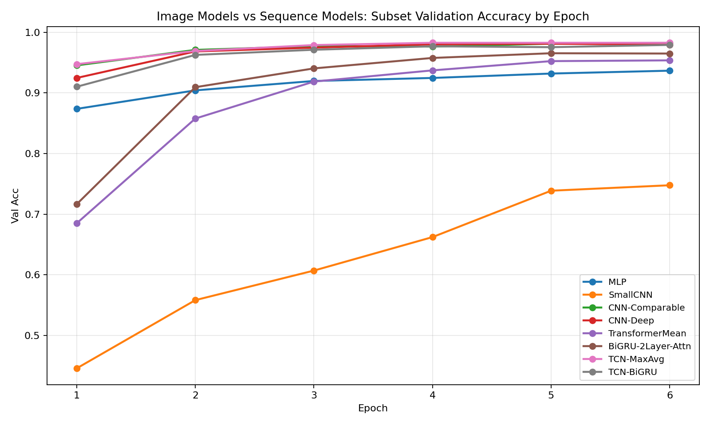
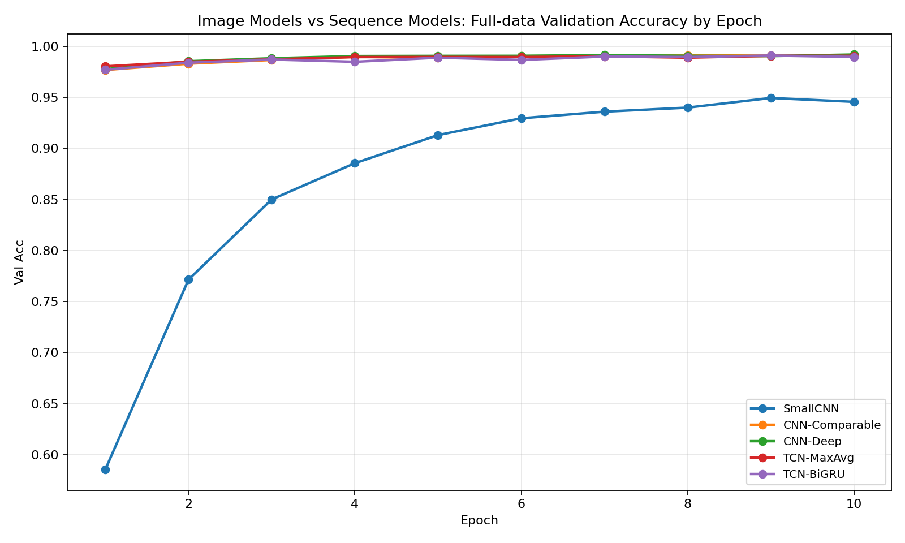
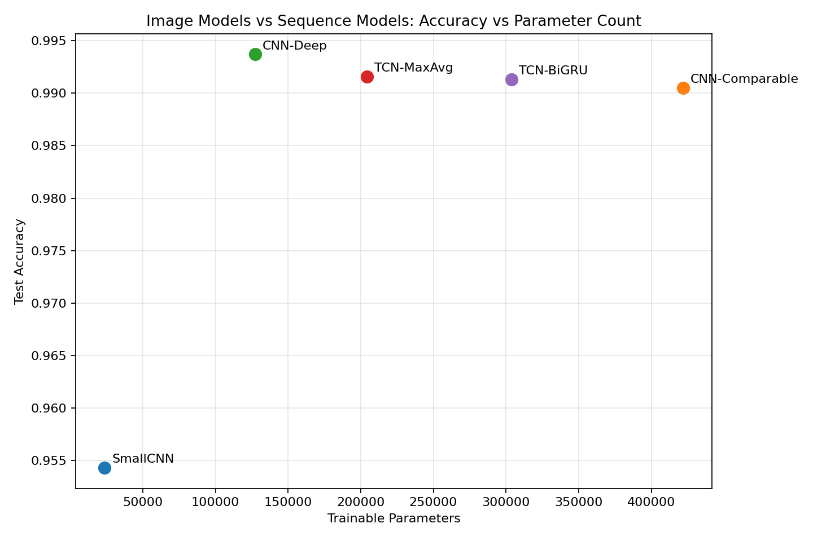
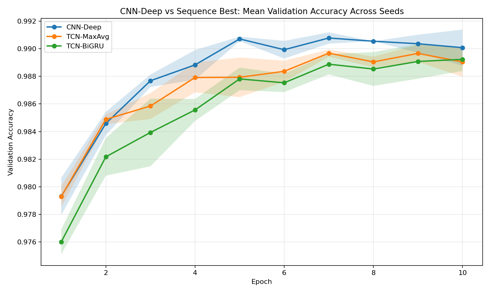
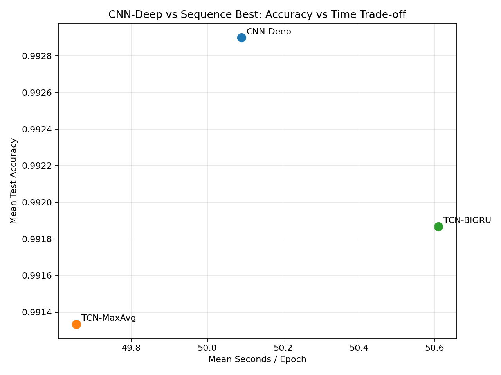

# MNIST Image CNN vs Sequence Models Report

## 目的

これまでの実験では、MNIST を `28` ステップの系列として扱った場合、`TCN-MaxAvg` と `TCN-BiGRU` が強いことが分かった。

しかし、まだ次の問いは残っていた。

> `TCN` が強いのは時系列モデルとして強いからか、それとも畳み込みの帰納バイアスが MNIST に刺さっただけか。

この問いを切るために、純粋な 2D 画像モデルである `MLP` / `CNN` と、既存の best sequence models を同じ条件で比較した。

## 仮説 3

MNIST では 2D 空間構造が本質なので、純粋な 2D CNN は時系列化した `TCN-MaxAvg` / `TCN-BiGRU` を上回る。

この仮説が正しければ、`CNN-Deep` のような 2D CNN が full-data 追試と multi-seed 平均で sequence best models を上回るはずである。

## 比較したモデル

| Model | 分類 | 特徴 |
| --- | --- | --- |
| `MLP` | 非構造画像 baseline | `28x28` を flatten して全結合で分類 |
| `SmallCNN` | 軽量 2D CNN | 2D convolution + global average pooling。パラメータ数は少ない |
| `CNN-Comparable` | 2D CNN | 2D convolution + flatten classifier。`TCN-BiGRU` に近いパラメータ規模 |
| `CNN-Deep` | 2D CNN | 3 段 2D convolution + `max + avg` pooling。今回の CNN 本命 |
| `TransformerMean` | sequence / attention | 画像の各行を token として mean pooling |
| `BiGRU-2Layer-Attn` | recurrent sequence | 2 層 BiGRU + attention pooling |
| `TCN-MaxAvg` | convolutional sequence | 行方向の 1D temporal convolution + `max + avg` pooling |
| `TCN-BiGRU` | hybrid sequence | TCN の出力系列を BiGRU で readout |

## 実験 1: subset screen

設定:

- train subset: `12000`
- val subset: `4000`
- test: `10000`
- epochs: `6`
- batch size: `256`
- seed: `42`

### 結果

| Model | Params | Best Val Acc | Test Acc | Elapsed |
| --- | ---: | ---: | ---: | ---: |
| `TCN-MaxAvg` | 204,362 | 0.982750 | 0.982400 | 182.00s |
| `CNN-Comparable` | 421,834 | 0.982500 | 0.985300 | 60.99s |
| `CNN-Deep` | 127,306 | 0.981250 | 0.986100 | 87.73s |
| `TCN-BiGRU` | 303,691 | 0.979250 | 0.982800 | 171.02s |
| `BiGRU-2Layer-Attn` | 420,619 | 0.965500 | 0.970200 | 143.86s |
| `TransformerMean` | 273,802 | 0.953750 | 0.960900 | 131.19s |
| `MLP` | 235,146 | 0.936750 | 0.943400 | 9.23s |
| `SmallCNN` | 23,818 | 0.747750 | 0.742700 | 58.44s |

収束曲線:

### 解釈

- subset の validation では `TCN-MaxAvg` が僅差トップだった
- test では `CNN-Deep` が最良で、`CNN-Comparable` も `TCN` 系を上回った
- `SmallCNN` は軽すぎて弱く、単に CNN なら何でも良いわけではなかった
- `MLP` は sequence best / CNN best には届かず、2D 局所構造を使うことが重要だった

この段階では、CNN 優位の兆候はあるが、validation では `TCN-MaxAvg` が勝っているため、仮説 3 は未確定とした。

## 実験 2: full-data finalists

設定:

- train: `40000`
- val: `20000`
- test: `10000`
- epochs: `10`
- batch size: `256`
- seed: `42`

対象:

- `SmallCNN`
- `CNN-Comparable`
- `CNN-Deep`
- `TCN-MaxAvg`
- `TCN-BiGRU`

### 結果

| Model | Params | Best Val Acc | Test Acc | Elapsed |
| --- | ---: | ---: | ---: | ---: |
| `CNN-Deep` | 127,306 | 0.991850 | 0.993700 | 501.35s |
| `CNN-Comparable` | 421,834 | 0.990950 | 0.990500 | 354.94s |
| `TCN-BiGRU` | 303,691 | 0.990850 | 0.991300 | 1092.13s |
| `TCN-MaxAvg` | 204,362 | 0.990550 | 0.991600 | 1033.07s |
| `SmallCNN` | 23,818 | 0.949350 | 0.954300 | 330.91s |

収束曲線:

accuracy vs parameter count:

### 解釈

- full-data seed `42` では `CNN-Deep` が validation / test の両方で最良
- `CNN-Deep` は `TCN-MaxAvg` / `TCN-BiGRU` より少ないパラメータで勝った
- `CNN-Comparable` は validation では `TCN` 系と同等だが、test では `CNN-Deep` ほど強くなかった
- CNN の強さは単純なパラメータ数増加ではなく、2D spatial inductive bias と pooling 設計に由来する可能性が高い

## 実験 3: multi-seed 確認

`CNN-Deep` が seed `42` だけで偶然勝った可能性を潰すため、seed `123` と `777` でも `CNN-Deep` を full-data 条件で追加実行した。

比較対象の `TCN-MaxAvg` / `TCN-BiGRU` は、前回の full-data 3-seed rerun を利用した。

seed:

- `42`
- `123`
- `777`

### 集約結果

| Model | Runs | Mean Val Acc | Std Val Acc | Mean Test Acc | Std Test Acc | Params |
| --- | ---: | ---: | ---: | ---: | ---: | ---: |
| `CNN-Deep` | 3 | 0.991317 | 0.000397 | 0.992900 | 0.001131 | 127,306 |
| `TCN-BiGRU` | 3 | 0.990117 | 0.000592 | 0.991867 | 0.000492 | 303,691 |
| `TCN-MaxAvg` | 3 | 0.989867 | 0.000487 | 0.991333 | 0.000249 | 204,362 |

multi-seed test accuracy:

multi-seed validation curve:

accuracy vs time:

### 解釈

- `CNN-Deep` は 3 seed 平均で validation / test の両方でトップ
- `CNN-Deep` は `TCN-BiGRU` よりパラメータ数が少ない
- test accuracy の平均差は `CNN-Deep - TCN-BiGRU = 0.001033`
- `TCN` 系もかなり強く、画像を行方向系列として扱っても MNIST では十分戦える
- ただし、最終的には 2D CNN の方が自然な帰納バイアスを持ち、より高い精度に到達した

## 仮説 3 の判定

| 仮説 | 比較 | 指標 | 結果 | 判定 |
| --- | --- | --- | --- | --- |
| 2D CNN は sequence best を上回る | `CNN-Deep` vs `TCN-BiGRU` | 3-seed mean val acc | `0.991317` vs `0.990117` | 採択 |
| 2D CNN は sequence best を上回る | `CNN-Deep` vs `TCN-BiGRU` | 3-seed mean test acc | `0.992900` vs `0.991867` | 採択 |
| CNN の優位はパラメータ数だけではない | `CNN-Deep` vs `TCN-BiGRU` | params | `127,306` vs `303,691` | 採択 |
| CNN なら軽量でも十分 | `SmallCNN` vs sequence best | full-data test acc | `0.954300` vs `0.991+` | 棄却 |

仮説 3 は採択する。

ただし、より正確には次のように解釈する。

> MNIST では 2D 空間構造を直接使う CNN が最も自然で、best sequence models を上回る。  
> 一方で、`TCN-MaxAvg` / `TCN-BiGRU` もかなり強く、行方向系列として見ても隣接行の局所構造だけで高精度に分類できる。

## 最終結論

今回の実験で、前回までの結論は次のように更新された。

- sequence-only 設定での best research model: `TCN-BiGRU`
- sequence-only 設定での best trade-off: `TCN-MaxAvg`
- 画像分類としての best model: `CNN-Deep`

重要な知見:

1. `TCN` の強さは temporal modeling というより、局所畳み込みの帰納バイアスに強く依存している
2. MNIST では、その帰納バイアスを 2D に拡張した CNN がさらに強い
3. ただし、`TCN` 系は 2D CNN に大差で負けたわけではなく、row-wise sequence representation でも MNIST の構造をかなり拾えている
4. `SmallCNN` が弱かったため、単に CNN ならよいのではなく、十分な表現力と pooling 設計が必要である

## 参照ファイル

- `models/experiment_models.py`
- `scripts/run_experiments.py`
- `artifacts/experiments/image_vs_sequence_summary.csv`
- `artifacts/experiments/image_vs_sequence_final_summary.csv`
- `artifacts/multiseed/image_vs_sequence_final_aggregate.csv`
- `artifacts/multiseed/image_cnn_top/seed*/image_cnn_top_summary.csv`
- `artifacts/plots/image_vs_sequence_*.png`
