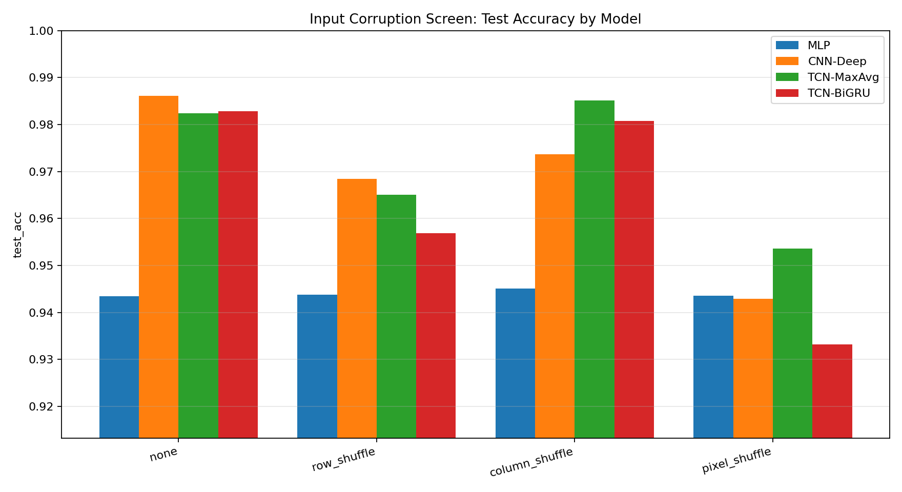
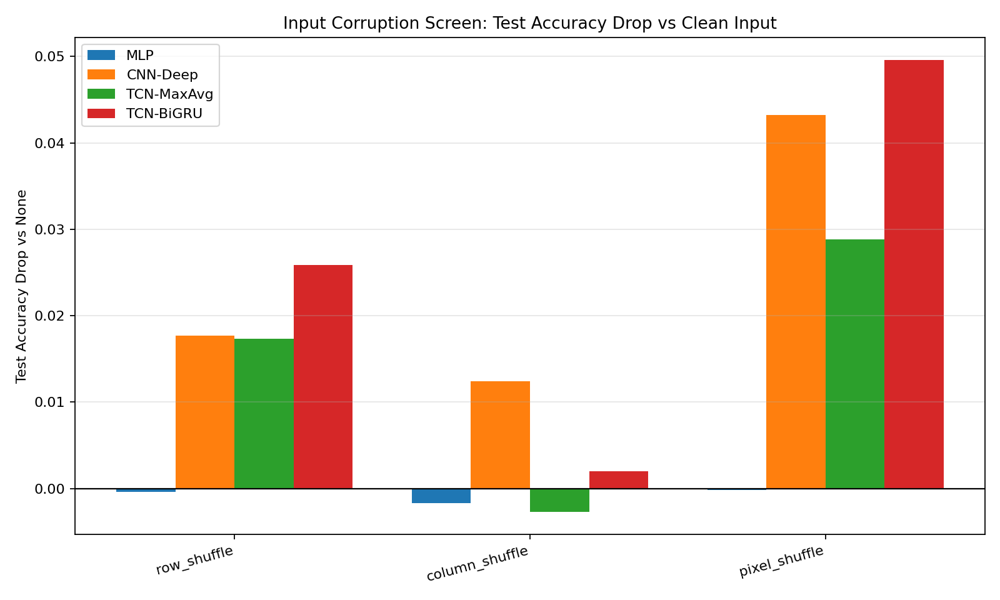
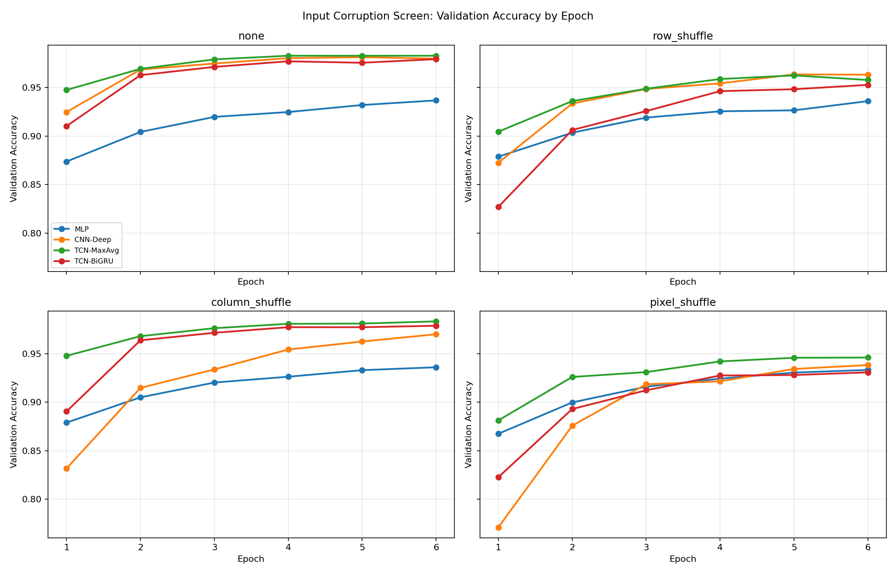

# MNIST Input Corruption Report

## 目的

前回までの実験では、次のことが分かった。

- sequence-only 設定では `TCN-BiGRU` / `TCN-MaxAvg` が強い
- 画像分類としては `CNN-Deep` が 3 seed 平均で最良
- `TCN` の強さは temporal modeling というより、局所畳み込みの帰納バイアスに由来する可能性が高い

今回の目的は、入力構造を意図的に壊して、`CNN-Deep` / `TCN` / `MLP` が何に依存しているかを調べること。

## 仮説 4

`TCN` の性能は、純粋な時系列理解ではなく、行方向の局所構造と畳み込みの帰納バイアスに依存している。

この仮説が正しければ、次のような傾向になるはずである。

- `MLP` は固定画素置換に強い
- `CNN-Deep` は 2D 局所構造を壊すと大きく落ちる
- `TCN-MaxAvg` は行順序を壊すと落ちる
- `TCN-MaxAvg` は列順序には比較的頑健である
- 全画素 shuffle では CNN / TCN の優位がかなり消える

## 入力破壊の種類

| Corruption | 内容 | 何を壊すか |
| --- | --- | --- |
| `none` | 元画像 | 基準 |
| `row_shuffle` | 全サンプル共通の固定ランダム行置換 | 行方向の順序、上下の局所性 |
| `column_shuffle` | 全サンプル共通の固定ランダム列置換 | 横方向の局所性 |
| `pixel_shuffle` | 全サンプル共通の固定ランダム画素置換 | 2D 局所構造全体 |

重要なのは、shuffle はサンプルごとに変えるのではなく、全サンプル共通の固定置換にしていること。  
そのため、情報量自体は消していない。壊しているのは空間的な近傍構造である。

## 比較したモデル

| Model | 分類 | 特徴 |
| --- | --- | --- |
| `MLP` | image baseline | `28x28` を flatten して全結合で分類。固定置換に強いはず |
| `CNN-Deep` | 2D CNN | 2D 局所構造を直接使う画像モデル |
| `TCN-MaxAvg` | convolutional sequence | 行を系列、列を channel として 1D temporal convolution |
| `TCN-BiGRU` | hybrid sequence | TCN の出力系列を BiGRU で readout |

## 実験設定

subset screen:

- train subset: `12000`
- val subset: `4000`
- test: `10000`
- epochs: `6`
- batch size: `256`
- seed: `42`

今回は破壊実験の方向性を見る exploratory screen として実行した。  
結論をさらに固める場合は、重要な corruption に絞って full-data / multi-seed 追試を行う。

## 結果

### Summary

| Corruption | Model | Best Val Acc | Test Acc | Test Drop vs None |
| --- | --- | ---: | ---: | ---: |
| `none` | `MLP` | 0.936750 | 0.943400 | 0.000000 |
| `none` | `CNN-Deep` | 0.981250 | 0.986100 | 0.000000 |
| `none` | `TCN-MaxAvg` | 0.982750 | 0.982400 | 0.000000 |
| `none` | `TCN-BiGRU` | 0.979250 | 0.982800 | 0.000000 |
| `row_shuffle` | `MLP` | 0.936000 | 0.943800 | -0.000400 |
| `row_shuffle` | `CNN-Deep` | 0.963500 | 0.968400 | 0.017700 |
| `row_shuffle` | `TCN-MaxAvg` | 0.962500 | 0.965100 | 0.017300 |
| `row_shuffle` | `TCN-BiGRU` | 0.952750 | 0.956900 | 0.025900 |
| `column_shuffle` | `MLP` | 0.936000 | 0.945100 | -0.001700 |
| `column_shuffle` | `CNN-Deep` | 0.970000 | 0.973700 | 0.012400 |
| `column_shuffle` | `TCN-MaxAvg` | 0.983250 | 0.985100 | -0.002700 |
| `column_shuffle` | `TCN-BiGRU` | 0.978750 | 0.980800 | 0.002000 |
| `pixel_shuffle` | `MLP` | 0.933250 | 0.943600 | -0.000200 |
| `pixel_shuffle` | `CNN-Deep` | 0.938250 | 0.942900 | 0.043200 |
| `pixel_shuffle` | `TCN-MaxAvg` | 0.946000 | 0.953600 | 0.028800 |
| `pixel_shuffle` | `TCN-BiGRU` | 0.930750 | 0.933200 | 0.049600 |

### Test accuracy

### Test accuracy drop

### Validation curves

## 解釈

### MLP は固定置換に強い

`MLP` は `none` の test acc `0.9434` に対して、`row_shuffle`, `column_shuffle`, `pixel_shuffle` でもほぼ同等だった。

これは期待通りで、MLP は flatten した各画素位置に個別の重みを持つ。固定置換であれば、学習時にその対応関係を覚え直せる。

### CNN は 2D 局所構造に強く依存している

`CNN-Deep` は clean input では test acc `0.9861` だったが、破壊すると次のように落ちた。

- `row_shuffle`: `0.9684`
- `column_shuffle`: `0.9737`
- `pixel_shuffle`: `0.9429`

特に `pixel_shuffle` では MLP とほぼ同等まで落ちた。  
これは、CNN の強さが 2D 近傍構造に強く依存していることを示す。

### TCN-MaxAvg は行方向の構造に依存し、列順序には頑健

`TCN-MaxAvg` は `row_shuffle` で test acc が `0.9824 -> 0.9651` に落ちた。  
これは、TCN が行方向の順序、つまり row-wise sequence の局所性を使っていることを示す。

一方で、`column_shuffle` では `0.9851` とほぼ落ちなかった。  
これは重要で、今回の TCN では列は `Conv1d` の channel として扱われる。`Conv1d` は channel 方向を dense に混ぜるため、列の「隣接順序」自体は使っていない。したがって固定の列置換にはかなり頑健だった。

### TCN-BiGRU は破壊入力にやや脆い

`TCN-BiGRU` は clean input では `0.9828` だったが、`pixel_shuffle` で `0.9332` まで落ちた。  
`TCN-MaxAvg` よりも落ち幅が大きい。

この結果から、recurrent readout は clean な TCN 特徴には効くが、入力構造を壊したときには必ずしも頑健ではない可能性がある。

## 仮説 4 の判定

| 仮説 | 比較 | 指標 | 結果 | 判定 |
| --- | --- | --- | --- | --- |
| MLP は固定置換に強い | `none` vs `pixel_shuffle` | test acc | `0.9434` vs `0.9436` | 採択 |
| CNN は 2D 局所構造に依存する | `CNN-Deep` none vs pixel | test acc drop | `0.0432` drop | 採択 |
| TCN は行順序に依存する | `TCN-MaxAvg` none vs row | test acc drop | `0.0173` drop | 採択 |
| TCN は列順序には依存しにくい | `TCN-MaxAvg` none vs column | test acc | `0.9824` vs `0.9851` | 採択 |
| pixel shuffle で CNN/TCN の優位は消える | best CNN/TCN vs MLP | test acc | 差が大きく縮小 | 一部採択 |

仮説 4 は概ね採択する。

ただし、より正確には次のように更新する。

> `TCN` は画像を時間として理解していたというより、行方向の局所構造を 1D convolution で拾っていた。  
> 列方向は channel として扱われるため、列の隣接順序にはほぼ依存しない。  
> 2D CNN は 2D 局所構造に強く依存しており、pixel shuffle で MLP レベルまで落ちる。

## 最終結論

今回の破壊実験で、これまでの解釈はさらに強まった。

- `CNN-Deep` の強さは 2D spatial locality に依存している
- `TCN-MaxAvg` の強さは row-wise locality に依存している
- `TCN-MaxAvg` は column order にはほぼ依存していない
- `MLP` は固定置換には頑健だが、clean input では CNN/TCN に劣る
- `TCN-BiGRU` は clean input では強いが、破壊入力では `TCN-MaxAvg` より脆い

この結果から、`TCN` の強さを「時系列理解」と呼ぶより、次のように表現する方が正確である。

> MNIST を行方向系列として扱ったとき、TCN は行方向の局所的な画像構造を 1D convolution で拾っている。

## 次にやるなら

今回の screen は seed `42` の subset 実験なので、結論をさらに固めるなら次を行う。

- `row_shuffle` と `pixel_shuffle` に絞って full-data 追試
- `TCN-MaxAvg`, `CNN-Deep`, `MLP` の 3 seed 比較
- `random per-sample shuffle` を追加して、固定置換を学べる場合と学べない場合を分ける

## 参照ファイル

- `scripts/run_experiments.py`
- `scripts/generate_report_plots.py`
- `artifacts/input_corruption/input_corruption_screen_summary.csv`
- `artifacts/input_corruption/input_corruption_screen_results.json`
- `artifacts/plots/input_corruption_*.png`
